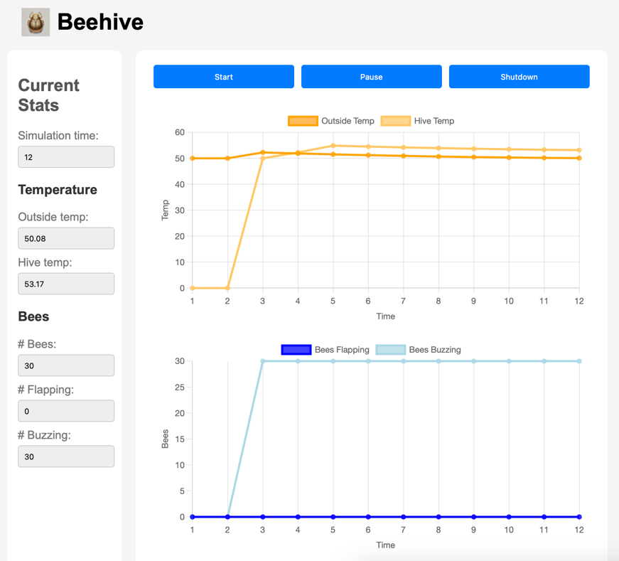

# Beehive

The beehive example consists of a beehive with bees. The goal of the bees is to maintain a temperature of the hive
within acceptable bounds by buzzing (heating the hive) and flapping (cooling the hive). As the outside temperature
changes, it causes changes to the hive temperature. The bees respond accordingly. A key aspect of this simulation is
to show how variability in responses (i.e. bees buzzing and fanning at different temperatures) can keep the temperature
more stable than if all the bees have the same tolerance.

## Running the simulation

The following instructions (Linux / Unix) will allow you to quickly install and run the beehive simulation.

If you haven't already installed Scarab, create the environment.  This example assumes an empty folder and that Python, and Git are already installed.

~~~
python -m venv ./venv
source venv/bin/activate
pip install --upgrade git+https://github.com/billdback/scarab
~~~

Now that you have Scarab installed, the next step is to create a configuration file.  See the TOML example below.

Finally, run the simulation with the following command (change the file name as needed).
~~~
python -m scarab.examples.beehive.beehive_sim test.toml
~~~

You should see a UI like the following:

To control the simulation, use the Start/Pause/Shutdown buttons.  The simulation will start in a paused state and then 
cycle after start is selected.  

## Example TOML file

~~~
# Example TOML file for testing the Beehive simulation.  You can use this as a basis for your own files.

# Bee settings.  The actual buzzing and flapping will vary based on the range.
[bees]
number_bees = 30

# if true, then the bees will vary the tolerance for when to flap or buzz.
vary_tolerance = true

# If varying, then these factors are used to calculate a normal distribution.  Otherwise, the value will be the
# average +/1 the standard deviation
temp_average = 70
temp_std_dev = 6

# Hive settings.  None currently.
[hive]

# Outside temperature ranges.
[outside_temp]
min_temperature = 50
max_temperature = 90

# General simulation settings.
[sim]
number_steps = 30  # how many steps to run
step_length = 1  # minimum time in seconds to run.
~~~

